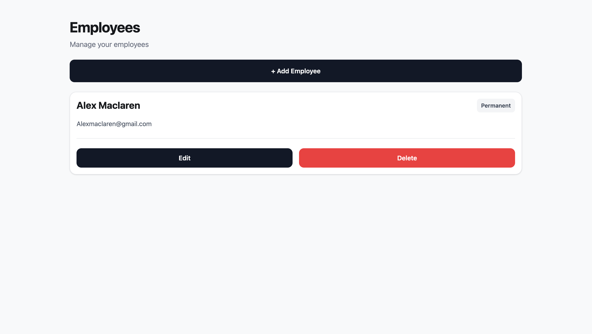
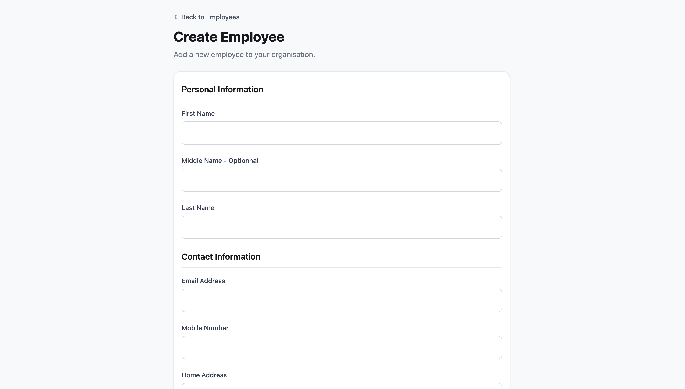
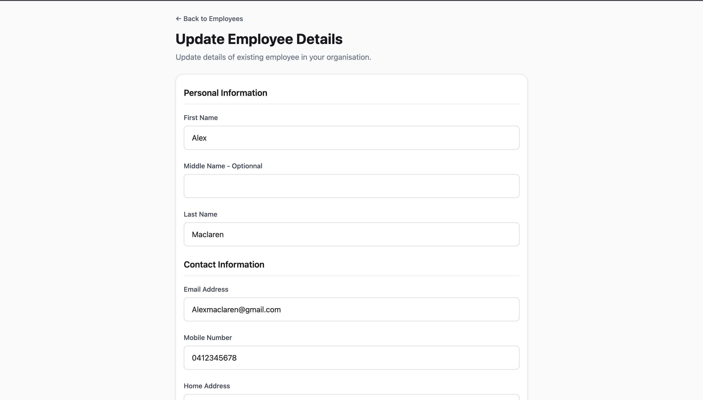
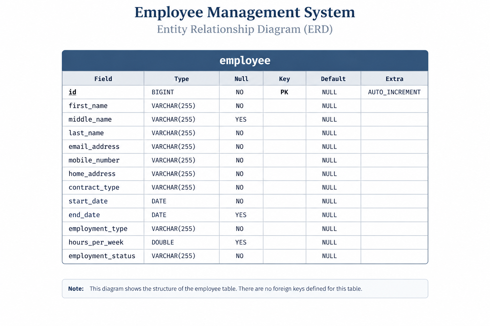

# Full-Stack Employee Management App


A full-stack **HR Employee Management System** built with React, TypeScript, Spring Boot and MySQL.

The system allows HR staff to add new employees to an organisation, manage employee information, update records and remove employees when required.

## Demo & Snippets

### Employee List



### Create Employee



### Update Employee



- **GitHub:** https://github.com/adamgalall95/employee-creator
- **Hosted link:** TBC

The app allows users to create, view, update and delete employees.

---

## Requirements / Purpose

### MVP

The MVP provides HR staff with the ability to:

- Add new employees to the organisation
- View employee records
- View individual employee information
- Update employee information
- Delete employee records
- Validate employee information
- Handle API errors

### Tech Stack

**Frontend**

- React
- TypeScript
- React Router
- React Query
- React Hook Form
- Zod
- Tailwind CSS

**Backend**

- Java
- Spring Boot
- Spring Data JPA
- MySQL

**Testing**

- Vitest
- React Testing Library
- JUnit
- Mockito
- REST Assured

### Why this stack?

React and TypeScript provide the frontend, while React Query handles communication with the backend.

Spring Boot provides the REST API and JPA handles database access.

Zod and React Hook Form are used for form validation. The backend also validates requests and enforces business rules before employee information is saved.

## Database Schema



---

## Build Steps

### Backend

From the project root:

```bash
./mvnw spring-boot:run
```

Make sure MySQL is running and the database configuration in `application.properties` matches your local setup.

### Frontend

```bash
cd front-end
npm install
npm run dev
```

The frontend uses the `VITE_BACKEND_URL` environment variable to connect to the backend.

### Tests

Frontend:

```bash
npm test -- --run
```

Backend:

```bash
./mvnw test
```

---

## Design Goals / Approach

The main goal was to build a practical HR system and understand how employee information moves through a complete full-stack application.

```text
React Form
    ↓
Zod Validation
    ↓
API Request
    ↓
Spring Boot Controller
    ↓
Service
    ↓
JPA Repository
    ↓
MySQL
```

Key design decisions:

- Keep frontend and backend validation separate.
- Use DTOs instead of exposing database entities directly through requests.
- Keep business rules in the backend service layer.
- Use React Query for server state.
- Use a global exception handler for consistent API errors.
- Keep components and services separated so the code is easier to test and maintain.

---

## Features

- Employee CRUD operations
- Employee search by email
- React Router navigation
- React Query for API state
- React Hook Form
- Zod validation
- Backend validation
- Business-rule validation
- Global API error handling
- Unit tests
- REST API tests
- Frontend component tests
- MySQL persistence

### Business Rules

Examples of rules implemented include:

- Permanent employees cannot have an end date.
- Contract employees require an end date.
- Contract end dates must be after the start date.
- Full-time employees work 38 hours.
- Part-time employees work between 1 and 37 hours.

---

## Known Issues

- The application is not currently deployed.
- GitHub Actions CI still needs to be added.
- Delete currently does not have a confirmation step.
- Search, filtering and pagination are not yet implemented.
- Some frontend tests still need to be aligned with the latest validation rules.

---

## Future Goals

- Add GitHub Actions for automated testing.
- Add employee search and filtering.
- Add pagination.
- Improve loading and error states.
- Add confirmation before deleting employees.
- Add authentication and authorisation.
- Deploy the frontend and backend.
- Add database migrations.
- Add more frontend and backend test coverage.

---

## Change Logs

### 27/08/2026 — Frontend Setup

- Created the React frontend.
- Added the main employee components.
- Added initial styling and form structure.

### 30/08/2026 — Frontend Testing

- Added frontend tests.
- Added validation tests.

### 31/08/2026 — Backend Setup

- Created the Spring Boot backend.
- Added the employee entity and repository.
- Added employee GET endpoints.

### 01/09/2026 — CRUD & Error Handling

- Added create and update employee endpoints.
- Added DTOs and ModelMapper.
- Added custom exceptions.
- Added global exception handling.

### 04/09/2026 — Backend Testing

- Added service unit tests.
- Added REST API tests.
- Added JSON response validation.
- Added H2 test database configuration.

### 12/09/2026 — Full-Stack Integration

- Connected the React frontend to the Spring Boot API.
- Added React Query mutations.
- Added create, update and delete functionality.
- Added frontend handling for backend errors.
- Added employee business rules and validation.

### 12/09/2026 — Validation Updates

- Refined employee validation.
- Added email existence checking.
- Updated frontend and backend validation to match the business rules.

---

## What did you struggle with?

### Full-stack validation

One of the main challenges was understanding where validation should happen.

Frontend validation provides immediate feedback to the user, but the backend must also validate requests because it cannot trust data coming from the frontend.

### Error handling

Another challenge was getting errors from the backend into a format that the frontend could use.

A global exception handler was added to return consistent API error responses.

### React Query

React Query required a different way of thinking about application state. Instead of manually updating the employee list after every mutation, queries can be invalidated and refreshed from the backend.

### Testing

The project helped build an understanding of the difference between:

- Component tests
- Unit tests
- API/integration tests

Each layer tests a different part of the application.

---

## Licensing Details

No open-source license has currently been added to the project.

---

## Further Details / Related Projects

- **Repository:** https://github.com/adamgalall95/
